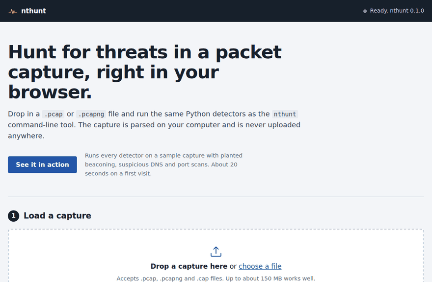

# Network Threat Hunting Toolkit

A Python toolkit and case-study portfolio for hunting malicious activity in network packet captures (PCAPs). Each case is analyzed with Wireshark and custom detection tools, then written up as an intelligence-style incident report with key judgments, confidence levels, indicators of compromise, and MITRE ATT&CK mapping.

> **Status:** In progress. See [docs/roadmap.md](docs/roadmap.md) for the build plan.

## Try it in your browser

[](https://ryanwitte4.github.io/network-threat-hunting-toolkit/?demo)

**One click, nothing to install.** The link above opens the web analyzer and immediately runs all four detectors on a synthetic capture with planted beaconing, suspicious DNS and port scans. You can also drop in your own `.pcap` / `.pcapng`. It is parsed locally and never uploaded.



The page runs the real `nthunt` package in the browser using [Pyodide](https://pyodide.org/) and Scapy, so its results match the command line. It can be installed as an app (the install button in the header, or "Add to Home Screen" on a phone). Details: [web/README.md](web/README.md).

## Why this project

Network traffic is one of the most reliable sources of evidence during an incident. Attackers can clear logs on a host, but beaconing, DNS lookups, and scanning still cross the wire. This project builds the skills to find that evidence, automate the hunt, and communicate findings the way an analyst would to decision-makers.

## Toolkit

| Module | What it detects | Status |
|---|---|---|
| `summary` | Top talkers, protocols, conversations, and DNS queries in a capture | ✅ |
| `beacon` | Hosts calling out at suspiciously regular intervals (possible C2) | ✅ |
| `dns` | High-entropy / unusually long domains (possible DGA or DNS tunneling) | ✅ |
| `scan` | Hosts touching many ports or hosts in a short window (reconnaissance) | ✅ |

### Usage

```bash
python -m nthunt summary data/pcaps/example.pcap
python -m nthunt beacon  data/pcaps/example.pcap
python -m nthunt dns     data/pcaps/example.pcap
python -m nthunt scan    data/pcaps/example.pcap
```

Each command prints JSON. Run `pytest` to check all four detectors against the synthetic lab capture in `web/samples/`.

## Case reports

| # | Case | Key finding | ATT&CK techniques |
|---|---|---|---|
| 01 | _TBD_ | | |

Reports live in [reports/](reports/). Each follows [reports/TEMPLATE.md](reports/TEMPLATE.md).

## Setup

```bash
git clone https://github.com/ryanwitte4/network-threat-hunting-toolkit.git
cd network-threat-hunting-toolkit
python -m venv .venv
source .venv/bin/activate        # Windows: .venv\Scripts\activate
pip install -r requirements.txt
```

To publish the web analyzer, go to **Settings › Pages** in the GitHub repo and set **Source** to **GitHub Actions**. Every push to `main` then runs the tests and redeploys the site ([.github/workflows/pages.yml](.github/workflows/pages.yml)).

Wireshark is used alongside the toolkit for manual analysis: https://www.wireshark.org/

PCAPs are **not** stored in this repo. See [data/README.md](data/README.md) for sources and safe-handling notes.

## Methodology

See [docs/methodology.md](docs/methodology.md).

## Skills demonstrated

Packet analysis (TCP/IP, DNS, HTTP/TLS), network detection engineering, Python (Scapy), WebAssembly deployment (Pyodide), CI/CD with GitHub Actions, threat hunting, incident reporting, intelligence analysis, MITRE ATT&CK.

## Author

Ryan C. Witte — B.S. Information Technology (Cybersecurity), Minor in Critical Intelligence Studies, Rutgers University–New Brunswick

## License

MIT — see [LICENSE](LICENSE).
